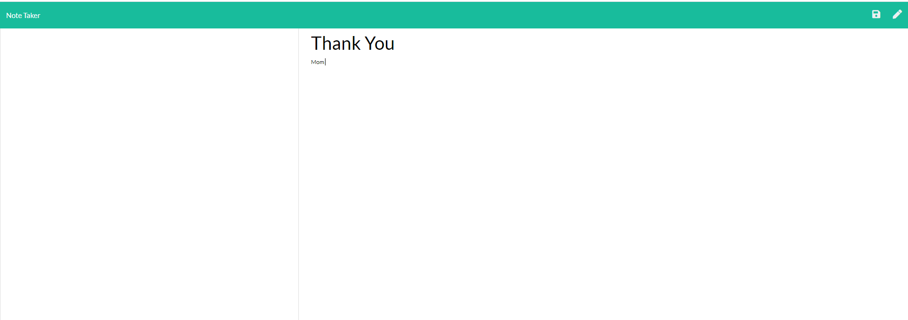

# note-taker
Create an application that can be used to write, save, and delete notes.

===========


<br>

## Get Notes

```
getNotes() {
    return this.readNotes().then(data => {
        let addedNotes;
        try{
            addedNotes = [].concat(JSON.parse(data))
        }

        catch(err){
            addedNotes = []
        }

        return addedNotes 
    })
}
```
<br>

## Add Notes

```
addNote(note){
    const {title, text} = note

    if (!title || !text) {
        console.log('must put title and text')
    }

    const newNote = {title, text, id: uuid()}

    return this.getNotes().then(data => [...data, newNote]).then(updatedData => this.writeNotes(updatedData)).then(() => newNote)
}
```
<br>

## Get Notes From Server

```
// route to notes
router.get("/notes", (req, res) => {
    res.sendFile(path.join(__dirname, "../public/notes.html"));
});

```

<br>

## Built With

* [HTML](https://developer.mozilla.org/en-US/docs/Web/HTML)
* [Javascript](https://developer.mozilla.org/en-US/docs/Web/JavaScript)
* [Heroku](https://dashboard.heroku.com/apps)

## Deployed Link

* [See Live Site](https://note-takerucb.herokuapp.com//)

## License

This project is licensed under the MIT License 

See also the list of [contributors](https://github.com/your/project/contributors) who participated in this project.

## Prerequisites

Git hub,
Git lab,
Git bash,
Visual studio,
Google chrome,
Bootstrap,
JavaScript
## Authors

**Jasmine Franklin C: 301-332-2313 E: jasminer.franklin@gmail** 

- [Link to Portfolio Site](https://jas-f.github.io/updated-portfolio/)
- [Link to Github](https://github.com/Jas-F/my-note-taker)
- [Link to LinkedIn](https://www.linkedin.com/in/jasmine-franklin-8b08ba121)

<p>&copy; UC Berkeley Extension Bootcamp.</p>
